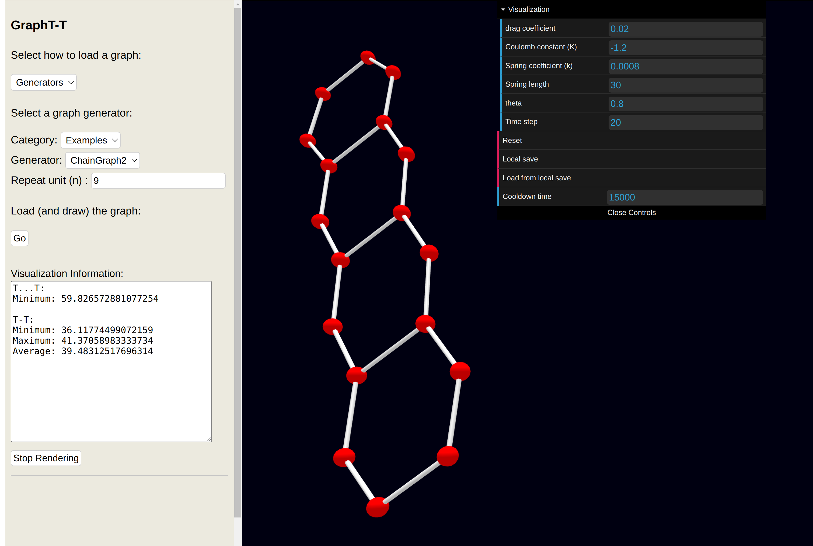

# GraphT-T
GraphT-T is an extension to GraphTea to visualize the 3D structures of the atom.



## How to run
- Download the zip file of the project under Code
- Run ```mvn install``` (The build tool "Apache Maven" should be installed.)
- Run ```java server.Server 2342 off``` to run locally (Java should be installed.)

